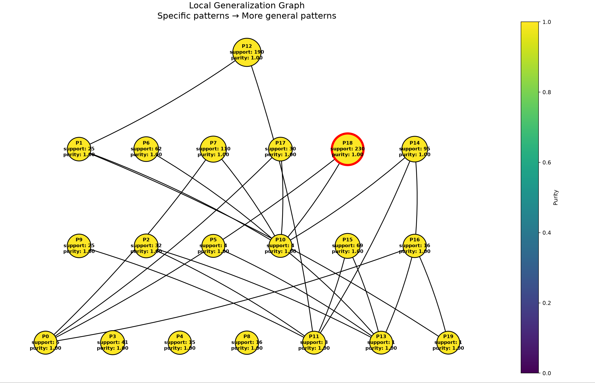

- Число локальных объектов: 1000
- Sigma генерации соседей: 1
- Sigma весов: 2
- Число candidate patterns: 20
- Минимальный support для включения в candidate_pattern: 10
- Минимальный purity для включения в candidate_pattern: 0.5

### Объект

`x = [-0.19031033896866376, -2.9446134191213615, -1.6293232938066395, -1.5208168078646251, 0.3992604857276518]`

При фиксированных обучаемых данных, модель имеет prediction_proba [1, 0], т.е модель наиболее всего уверена в том, что класс данного объекта 1

Предсказанный класс: `1`

### Полученное объяснение

- feature 1 ∈ [-3.4206694632451207, 1.4058095221387108]
- feature 2 ∈ [-4.784136473395524, -1.0705783500900081]
- feature 3 ∈ [-3.7431112608580897, -0.7729676159122263]
- feature 4 ∈ [-2.393375673510376, -0.008340679528269224]
- feature 5 ∈ [-0.6691282770714042, 0.9203080873913472]

### Метрики

- Support: 230
- Coverage: 0.23

### Граф обобщения

