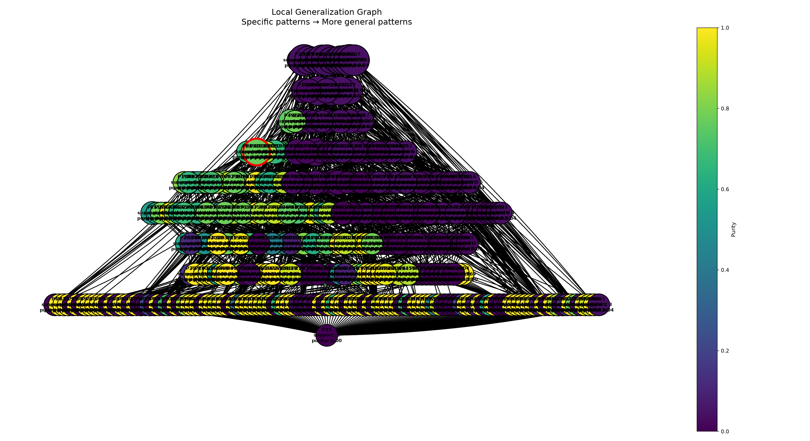

- Число локальных объектов: 1000
- Sigma генерации соседей: 3
- Sigma весов: 2
- Число candidate patterns: 466
- Минимальный purity для включения в candidate_explanation: 0.6
- Минимальный support для включения в candidate_explanation: 80/75

### Объект

`Индекс 141 в x_train`

При фиксированных обучаемых данных, модель имеет разницу в predict_proba = 0.28, т.е модель наименее уверенна в классифакации данного объекта

Предсказанный класс: `0`

### Метрики полученного объяснения с need_support = 80

- Support: 83
- Coverage: 0.083
- Purity: 0.7676442823887023

### Метрики полученного объяснения с need_support = 75

- Support: 79
- Coverage: 0.079
- Purity: 0.8233785495273871

### Граф обобщения

