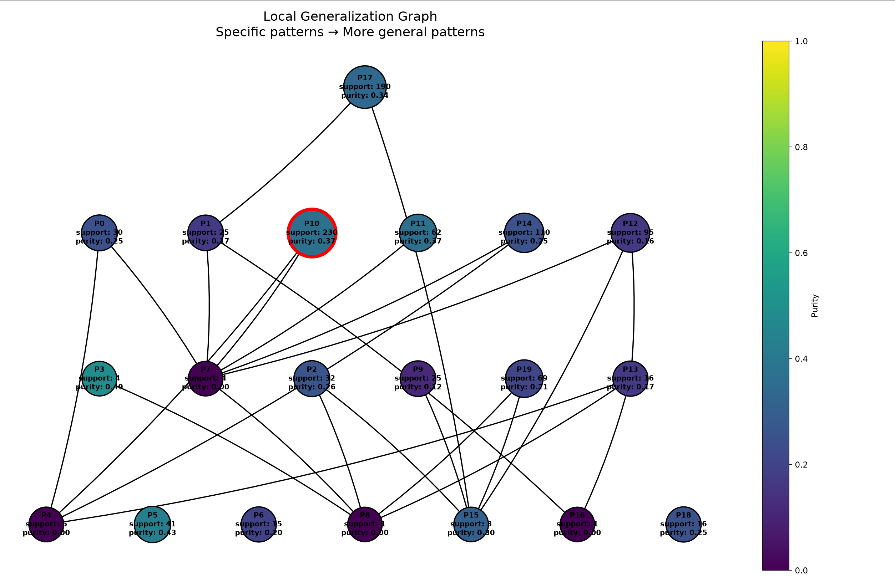

- Число локальных объектов: 1000
- Sigma генерации соседей: 1
- Sigma весов: 2
- Число candidate patterns: 20
- Минимальный support для включения в candidate_pattern: 10
- Минимальный purity для включения в candidate_pattern: 0.2

### Объект

`x = [-1.8347662677564696, 0.9088480958299254, -0.43596153088085343, -0.14814968334462109, 0.5985540958545472]`

При фиксированных обучаемых данных, модель имеет дельту в предсказании класса 0.06, т.е модель имеет наименьшую уверенность в своём предсказании

Предсказанный класс: `1`

### Полученное объяснение

- feature 1 ∈ [-5.065125392032927, -0.23864640664909498]
- feature 2 ∈ [-0.9306749584442364, 2.782883164861279]
- feature 3 ∈ [-2.5497494979323037, 0.4203941470135598]
- feature 4 ∈ [-1.0207085489903722, 1.3643264449917347]
- feature 5 ∈ [-0.4698346669445088, 1.1196016975182426]

### Метрики

- Support: 230
- Coverage: 0.23

### Граф обобщения

