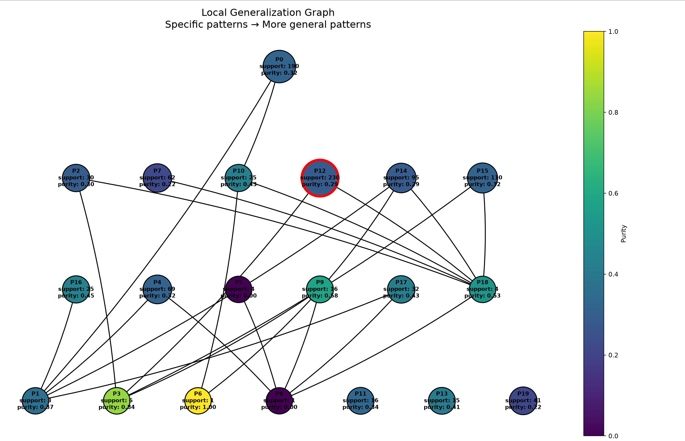

- Число локальных объектов: 1000
- Sigma генерации соседей: 1
- Sigma весов: 2
- Число candidate patterns: 20
- Минимальный support для включения в candidate_pattern: 10
- Минимальный purity для включения в candidate_pattern: 0.2

### Объект

`x = [0.6760665728238865, -0.5033309185654469, 0.4313305841642763, -2.018932779075593, 0.2929281424970152]`

При фиксированных обучаемых данных, модель имеет дельту prediction_proba примерно 0.45, т.е имеет примерно среднюю уверенность в своём предсказании

Предсказанный класс: `0`

### Полученное объяснение

- feature 1 ∈ [-2.5542925514525705, 2.272186433931261]
- feature 2 ∈ [-4.784136473395524, -1.0705783500900081]
- feature 3 ∈ [-1.682457382887174, 1.2876862620586895]
- feature 4 ∈ [-2.891491644721344, -0.506456650739237]
- feature 5 ∈ [-0.7754606203020409, 0.8139757441607105]

### Метрики

- Support: 230
- Coverage: 0.23

### Граф обобщения

