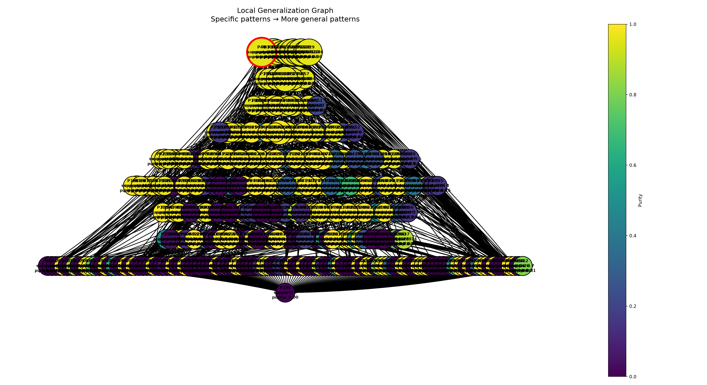

- Число локальных объектов: 1000
- Sigma генерации соседей: 3
- Sigma весов: 2
- Число candidate patterns: 466
- Минимальный purity для включения в candidate_explanation: 0.6
- Минимальный support для включения в candidate_explanation: 375

### Объект

`Индекс 198 в x_train`

При фиксированных обучаемых данных, модель имеет разницу в predict_proba = 0.64, т.е модель наиболее средне уверенна в классифакации данного объекта

Предсказанный класс: `1`

### Метрики полученного объяснения

- Support: 387
- Coverage: 0.387
- Purity: 0.9578289998340623

### Граф обобщения

