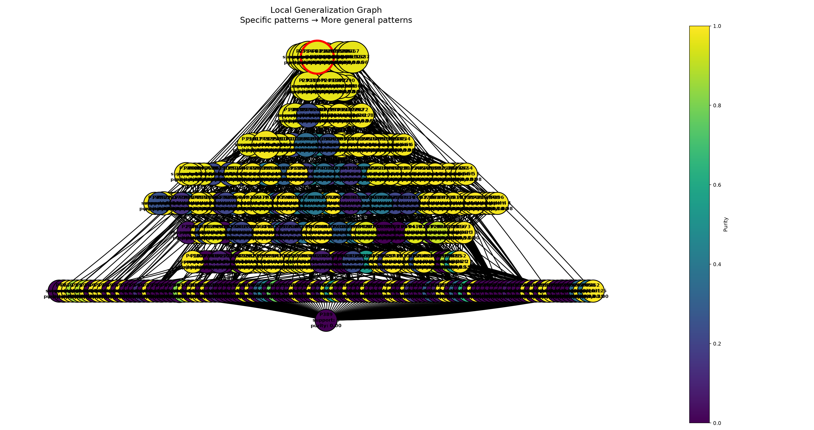

- Число локальных объектов: 1000
- Sigma генерации соседей: 3
- Sigma весов: 2
- Число candidate patterns: 466
- Минимальный purity для включения в candidate_explanation: 0.6
- Минимальный support для включения в candidate_explanation: 300
- ESS: 1.1179602068043957

### Объект

`Индекс 43 в x_test`

При фиксированных обучаемых данных, модель имеет разницу в predict_proba = 0, т.е модель наименее уверенна в классифакации данного объекта на тестовых даных

Предсказанный класс: `1`

### Метрики полученного объяснения

- Support: 346
- Coverage: 0.346
- Purity: 0.9628243180456993

### Метрики полученного объяснения с версией без весов с need_purity = 15, need_support = 0.55

- Support: 15
- Coverage: 0.015
- Purity:  0.6

### Граф обобщения

