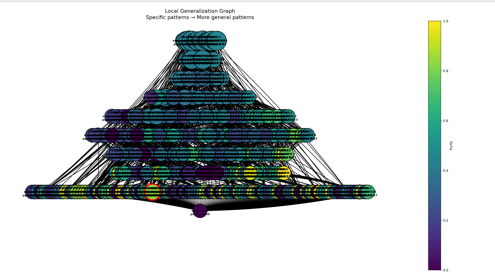

- Число локальных объектов: 1000
- Sigma генерации соседей: 1.2
- Sigma весов: 2
- Число candidate patterns: 466
- Минимальный purity для включения в candidate_explanation: 0.6
- Минимальный support для включения в candidate_explanation: 15
- ESS = 103.20507853603021
- local_neighborhood_weighted 0.43107419010014647
- local_neighborhood_unweighted 0.483

### Объект

`Индекс 141 в x_train`

При фиксированных обучаемых данных, модель имеет разницу в predict_proba = 0.28, т.е модель наименее уверенна в классифакации данного объекта

Предсказанный класс: `0`

### Метрики полученного объяснения 
- Support: 21
- Coverage: 0.021
- Purity: 0.8215092485076204
- Predicted class: 0
- Explanation length: 23

### Граф обобщения

