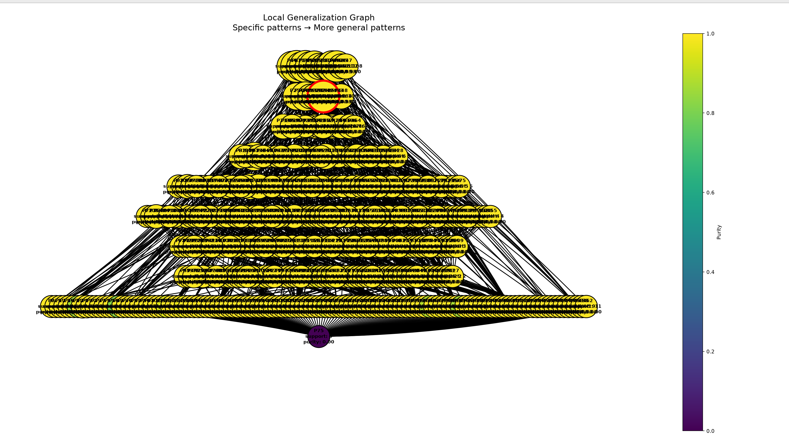

- Число локальных объектов: 1000
- Sigma генерации соседей: 1.2
- Sigma весов: 2
- Число candidate patterns: 466
- Минимальный purity для включения в candidate_explanation: 0.6
- Минимальный support для включения в candidate_explanation: 200
- ESS: 103.20507853603021
- local_neighborhood_weighted 0.9897052973708557
- local_neighborhood_unweighted 0.948
### Объект

`Индекс 0 в x_train`

При фиксированных обучаемых данных, модель имеет разницу в predict_proba = 1, т.е модель наиболее уверенна в классифакации данного объекта

Предсказанный класс: `1`

### Метрики полученного объяснения

- Support: 287
- Coverage: 0.287
- Purity: 0.995209936587617
- Predicted class: 1
- Explanation length: 30

### Граф обобщения

