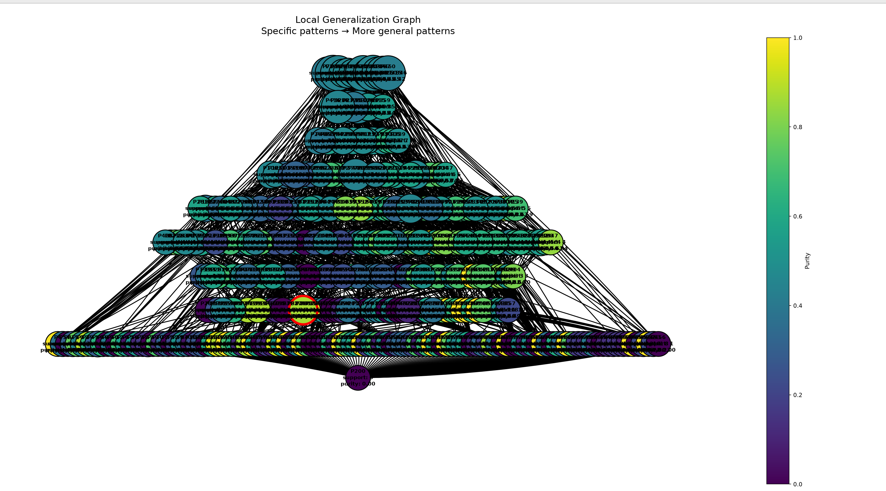

- Число локальных объектов: 1000
- Sigma генерации соседей: 1.2
- Sigma весов: 2
- Число candidate patterns: 466
- Минимальный purity для включения в candidate_explanation: 0.7
- Минимальный support для включения в candidate_explanation: 15
- ESS:  103.20507853603017
- local_neighborhood_weighted 0.435872348300031
- local_neighborhood_unweighted 0.427

### Объект

`Индекс 198 в x_train`

При фиксированных обучаемых данных, модель имеет разницу в predict_proba = 0.64, т.е модель наиболее средне уверенна в классифакации данного объекта

Предсказанный класс: `1`

### Метрики полученного объяснения

- Support: 15
- Coverage: 0.015
- Purity: 0.8681024757733109
- Predicted class: 1
- Explanation length: 21

### Граф обобщения

