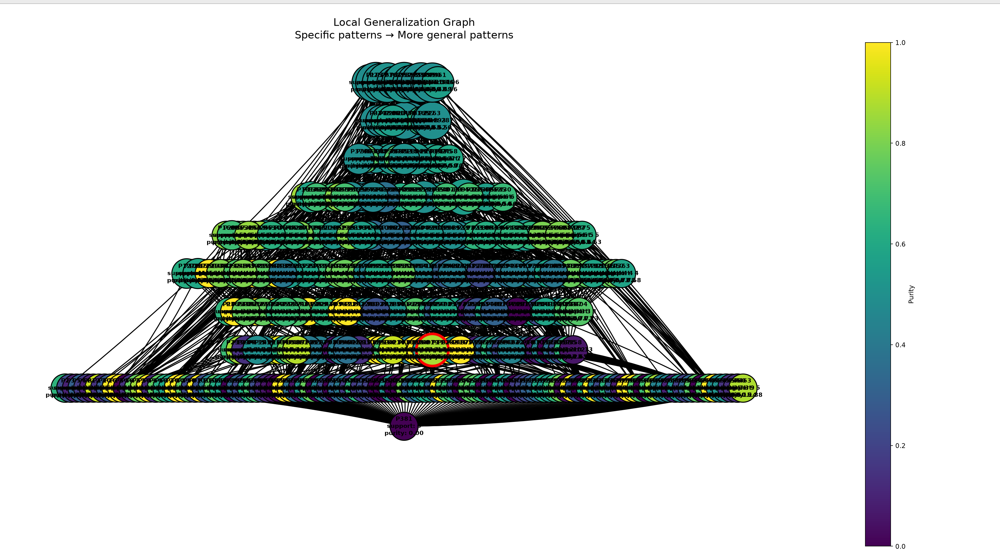

- Число локальных объектов: 1000
- Sigma генерации соседей: 1.2
- Sigma весов: 2
- Число candidate patterns: 466
- ESS:  103.20507853603011
- local_neighborhood_weighted 0.4914792778133437
- local_neighborhood_unweighted 0.432

### Объект

`Индекс 43 в x_test`

При фиксированных обучаемых данных, модель имеет разницу в predict_proba = 0, т.е модель наименее уверенна в классифакации данного объекта на тестовых даных

Предсказанный класс: `1`

### Метрики полученного объяснения

- Support: 15
- Coverage: 0.015
- Purity: 0.8681024757733115
- Predicted class: 1
- Explanation length: 21

### Граф обобщения

